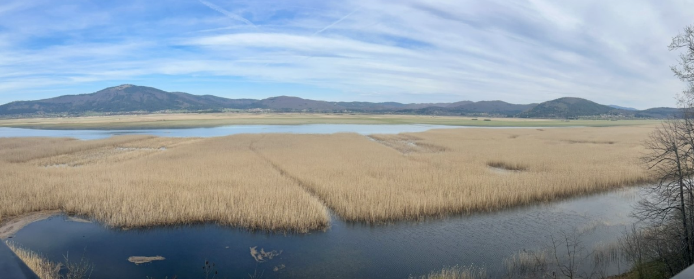

# KRAS Platforma
**Kraški Raziskovalni Analitični Sistem**

KRAS Platforma je analitična in demonstracijska geoprostorska platforma za spremljanje dinamičnih kraških vodnih sistemov, interpretacijo okoljskih sprememb ter podporo odločanju v prostoru.

V jedru platforma povezuje hidrologijo, daljinsko zaznavanje, kmetijstvo in biodiverziteto v eno uporabno delovno okolje. Namesto razpršenih podatkovnih slojev in ročnega preverjanja različnih virov uporabniku ponudi enoten pogled na vodo, poplavljanje, rabo prostora, stanje izbranih parcel in GERK-ov ter spremembe, zaznane iz satelitskih posnetkov.

Ta projekt je zasnovan tako, da je hkrati:

- strokovno uporaben za raziskovalce, upravljavce prostora in javne institucije,
- operativno koristen za kmetijstvo in terensko odločanje,
- investitorsko zanimiv kot osnova za širšo regionalno ali nacionalno platformo za kraške pokrajine.

---

## Zakaj je projekt pomemben

Kraški sistemi so med najbolj kompleksnimi in najmanj intuitivnimi prostori za upravljanje. Vodni režim se hitro spreminja, posledice pa se pokažejo na več ravneh hkrati:

- pri poplavljanju kmetijskih zemljišč,
- pri razpoložljivosti in kakovosti vode,
- pri spremembah habitatov,
- pri pritisku na infrastrukturo in prostorsko načrtovanje,
- pri odločanju lastnikov zemljišč, občin, upravljavcev in raziskovalcev.

Večina obstoječih rešitev pokaže le en del slike. KRAS Platforma je odgovor na to fragmentacijo: zgradi enoten, razumljiv in analitično močan sistem za interpretacijo prostora na podlagi realnih meritev, uradnih evidenc in satelitskih opazovanj.

---

## Kaj platforma ponuja

1. Monitoring jezera v skoraj realnem času
2. Arhivski analitični pogled obsega poplav
3. Osnovno spremljanje biodiverzitete in kakovosti vode
4. Satelitsko podprto zaznavanje sprememb v kmetijstvu
5. Poročila za odločanje

---

## Glavna vrednost za investitorje in partnerje

Ključna investicijska prednost je v tem, da projekt že danes povezuje več podatkovnih domen v konkreten uporabniški izdelek. To bistveno znižuje razkorak med raziskavo in implementacijo.

Platforma je primerna za nadgradnjo v:

- SaaS analitično orodje,
- javni prostorski portal,
- B2G rešitev za upravljavce prostora,
- B2B rešitev za agro, zavarovalniški ali okoljski sektor.

---

## Podatkovni viri

Projekt uporablja kombinacijo uradnih, raziskovalnih in satelitskih virov:

- višine vodostajev za merilno postajo Dolenje Jezero,
- digitalni model površja z ločljivostjo 25 cm,
- posnetki satelitskih sistemov Sentinel-2 in PlanetScope,
- kataster parcel,
- GERK evidenco,
- GBIF za podatke o pticah,
- evidenco invazivnih vrst,
- meteorološke podatke ARSO in Open-Meteo.

---

## Ciljni uporabniki

Platforma je posebej relevantna za naslednje skupine:

- raziskovalne inštitucije,
- občine in regionalne razvojne akterje,
- upravljavce zavarovanih ali občutljivih območij,
- ministrstva in javne službe,
- kmete in svetovalne službe,
- podjetja na presečišču geoinformatike, okolja in agrotehnologije.

---

## Vizija razvoja

Naslednji naravni koraki razvoja platforme so:

- prenos tehnologije na druga poplavna območja,
- avtomatska detekcija košenj z umetno inteligenco,
- digitalne storitve za kmetijstvo na poplavnih območjih,
- spremljanje odziva flore in favne,
- okoljski monitoring in podatkovno podprte simulacije.

---
